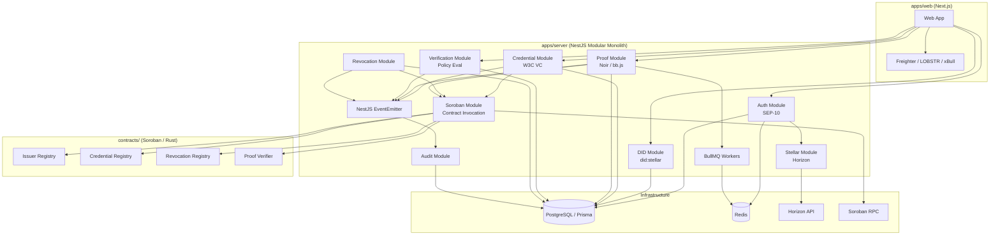
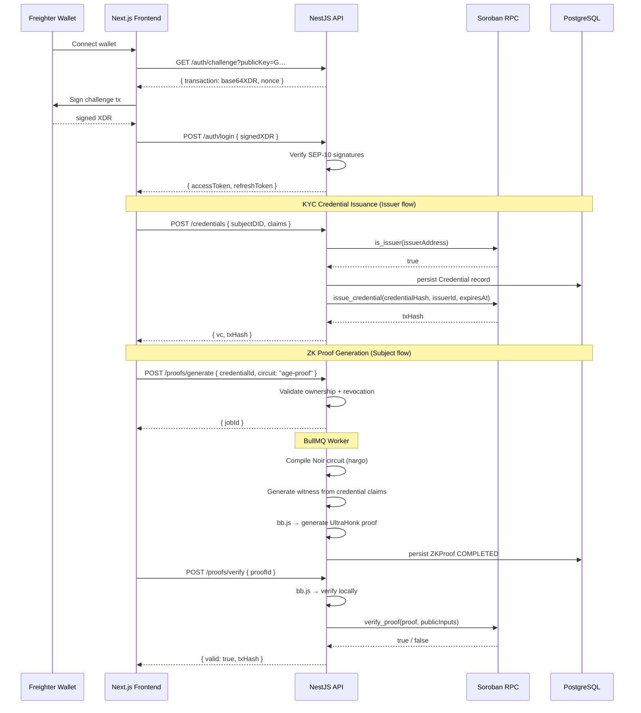

# Design Document: zkKYC on Stellar

## Overview

zkKYC is a privacy-preserving compliance infrastructure platform for the Stellar ecosystem. Users authenticate with their Stellar wallets (Freighter, LOBSTR, xBull) via the SEP-10 challenge/response protocol, obtain a `did:stellar` DID, receive W3C Verifiable Credentials from authorized KYC issuers, and generate Noir ZK proofs to prove compliance to verifiers — without exposing private data.

The V1 system is a NestJS modular monolith (`apps/server/`) backed by PostgreSQL (Prisma), Redis, and BullMQ. Soroban smart contracts (Rust, `contracts/`) manage on-chain state: issuer registry, credential hashes, revocations, and proof verification. Noir circuits (`circuits/`) encode the ZK proof logic. A Next.js frontend (`apps/web/`) handles user interactions and can optionally generate proofs client-side in the browser via WASM.

Key design decisions:
- **No PII on-chain or in off-chain DB beyond structured claims**: only `country`, `age`, `accredited` fields plus a credential hash.
- **Soroban for on-chain truth**: four contracts handle issuer registry, credential anchoring, revocation, and ZK proof verification.
- **Noir UltraHonk + bb.js** for proof generation server-side (BullMQ worker); client-side generation via WASM is a future enhancement.
- **`did:stellar` method** derived deterministically from the user's Stellar Ed25519 public key.

---

## Architecture

### High-Level System Diagram



### Credential and Proof Flow



### Module Layering

Each NestJS module follows:
```
Controller → Service → Repository → Prisma Client
```

Cross-module dependencies are satisfied by NestJS `@Module({ imports: [...] })` with exported services. The Soroban_Module and Stellar_Module are shared infrastructure modules imported by domain modules that need on-chain operations.

---

## Components and Interfaces

### Auth Module (`src/modules/auth/`)

**Controller: `AuthController`**
- `GET /auth/challenge?publicKey=G…` — returns `{ transaction: string (base64 XDR), nonce: string }`
- `POST /auth/login` — accepts `{ signedTransaction: string }`, returns `{ accessToken, refreshToken }`
- `POST /auth/refresh` — accepts `{ refreshToken }`, returns `{ accessToken }`
- `POST /auth/logout` — invalidates session

**Service: `AuthService`**
```typescript
interface AuthService {
  generateChallenge(publicKey: string): Promise<{ transaction: string; nonce: string }>;
  verifyChallengeAndLogin(signedXDR: string): Promise<{ accessToken: string; refreshToken: string }>;
  refreshAccessToken(refreshToken: string): Promise<{ accessToken: string }>;
  logout(refreshToken: string): Promise<void>;
}
```

**Implementation notes:**
- Uses `@stellar/stellar-sdk`'s `Utils.buildChallengeTx()` to generate the SEP-10 challenge transaction signed by the server keypair
- Uses `Utils.readChallengeTx()` + `Utils.verifyChallengeTxSigners()` to validate the client-signed response
- Nonces stored in Redis with 5-minute TTL; used nonces rejected immediately (replay prevention)
- JWTs signed with RS256; refresh tokens stored in Redis with 7-day TTL

**Dependencies**: `@stellar/stellar-sdk`, `@nestjs/jwt`, Redis (`ioredis`)

---

### DID Module (`src/modules/did/`)

**Controller: `DIDController`**
- `POST /did/create` — protected, returns `DIDDocument`
- `GET /did/:id` — public, returns `DIDDocument | 404`

**Service: `DIDService`**
```typescript
interface DIDService {
  createOrFetchDID(stellarPublicKey: string): Promise<DIDDocument>;
  resolveDID(did: string): Promise<DIDDocument | null>;
}
```

**`did:stellar` method:**
- DID format: `did:stellar:<stellar-public-key>` (e.g. `did:stellar:GBXXX…`)
- DID Document contains a single Ed25519 verification method derived from the Stellar keypair
- Stored in the `dids` table; resolution is a DB lookup with no external resolver needed in V1
- Uses `@mavennet/stllr-did-resolver` as reference for document structure; V1 constructs the document inline without a registry contract

**DID Document shape:**
```json
{
  "@context": ["https://www.w3.org/ns/did/v1"],
  "id": "did:stellar:GBXXX…",
  "verificationMethod": [{
    "id": "did:stellar:GBXXX…#key-1",
    "type": "JsonWebKey2020",
    "controller": "did:stellar:GBXXX…",
    "publicKeyJwk": { "kty": "OKP", "crv": "Ed25519", "x": "<base64url>" }
  }],
  "authentication": ["did:stellar:GBXXX…#key-1"]
}
```

---

### Credential Module (`src/modules/credentials/`)

**Controller: `CredentialController`**
- `POST /credentials` — issuer role required
- `GET /credentials/:id` — authorized subject or issuer
- `POST /credentials/verify` — public

**Service: `CredentialService`**
```typescript
interface CredentialService {
  issueCredential(issuerDID: string, subjectDID: string, claims: KYCClaims): Promise<VerifiableCredential>;
  getCredential(id: string, requesterDID: string): Promise<VerifiableCredential>;
  verifyCredential(vc: VerifiableCredential): Promise<VerificationResult>;
}

interface KYCClaims {
  country: string;    // ISO 3166-1 alpha-2
  age: number;        // integer years
  accredited: boolean;
}
```

**VC Format**: W3C Verifiable Credentials Data Model 1.1, signed with `Ed25519Signature2020` using the issuer's Stellar Ed25519 keypair.

**Credential hash**: `SHA-256(JSON.stringify(sortedClaims + issuerId + subjectDID + issuedAt))` stored on-chain via Credential Registry Contract.

**On-chain anchoring**: After persisting to DB, calls `SorobanService.invokeContract('credential-registry', 'issue_credential', [credentialHash, issuerId, issuedAt, expiresAt])`. The DB record stores the returned `txHash`.

---

### Proof Module (`src/modules/proofs/`)

**Controller: `ProofController`**
- `POST /proofs/generate` — authenticated subject
- `POST /proofs/verify` — authenticated
- `GET /proofs/jobs/:jobId` — authenticated

**Service: `ProofService`**
```typescript
interface ProofService {
  enqueueProofGeneration(subjectDID: string, credentialId: string, params: ProofParams): Promise<{ jobId: string }>;
  verifyProof(proofId: string, verifierDID: string): Promise<ProofVerificationResult>;
  getJobStatus(jobId: string): Promise<JobStatus>;
}

interface ProofParams {
  circuit: 'age-proof' | 'residency-proof' | 'accredited-investor' | 'sanctions-check';
  publicInputs: Record<string, unknown>;  // threshold values, etc.
}
```

**BullMQ Worker: `ProofGenerationWorker`**
```typescript
// Runs in BullMQ worker context
async processJob(job: Job<ProofJobData>): Promise<void> {
  // 1. Load compiled Noir circuit artifact from circuits/<circuit>/target/
  // 2. Instantiate Noir + UltraHonkBackend from @noir-lang/noir_js and @aztec/bb.js
  // 3. Generate witness: noir.execute({ ...privateClaims, ...publicInputs })
  // 4. Generate proof: backend.generateProof(witness)
  // 5. Persist proof artifact + public inputs to ZKProof record
  // 6. Emit ProofGenerated domain event
}
```

**Circuit artifacts**: Each circuit is pre-compiled with `nargo compile` and the output `.json` artifact committed to `circuits/<name>/target/<name>.json`. The worker loads the artifact at runtime — no runtime compilation needed.

**Verification flow:**
1. Load verification key (pre-generated with `bb write_vk`) from `circuits/<name>/target/vk`
2. `backend.verifyProof(proof)` — local verification using bb.js
3. If local verification passes, submit to Soroban Proof Verifier Contract
4. Persist result + on-chain tx hash

**Note on CPU limits**: UltraHonk on-chain verification is computationally expensive. For testnet/mainnet, use `--limits unlimited` or wait for Protocol 26 improvements. V1 targets testnet with local CPU limits relaxed.

---

### Verification Module (`src/modules/verification/`)

**Service: `VerificationService`**
```typescript
interface VerificationService {
  evaluatePolicy(proofPublicOutputs: Record<string, unknown>, policy: Policy): AccessDecision;
  persistAndEmit(subjectDID: string, verifierDID: string, policyId: string, decision: AccessDecision): Promise<void>;
}

interface Policy {
  rules: PolicyRule[];
}

interface PolicyRule {
  field: string;
  operator: 'eq' | 'neq' | 'gte' | 'lte' | 'in' | 'not_in';
  value: unknown;
}

interface AccessDecision {
  decision: 'allow' | 'deny';
  failingRules?: PolicyRule[];
}
```

Policy evaluation is pure (no I/O), making it straightforwardly property-testable.

---

### Revocation Module (`src/modules/revocation/`)

**Controller: `RevocationController`**
- `POST /revocations` — issuer role required
- `GET /revocations/:credentialId` — public

**Service: `RevocationService`**
```typescript
interface RevocationService {
  revokeCredential(credentialId: string, issuerDID: string): Promise<{ txHash: string }>;
  getRevocationStatus(credentialId: string): Promise<RevocationStatus>;
}
```

Revocation writes to DB first (synchronous), then invokes `SorobanService.invokeContract('revocation-registry', 'revoke_credential', [credentialId])`. The `CredentialRevoked` domain event is emitted only after both succeed.

---

### Stellar Module (`src/modules/stellar/`)

**Service: `StellarService`**
```typescript
interface StellarService {
  generateKeypair(): { publicKey: string; secretKey: string };
  getAccount(publicKey: string): Promise<AccountRecord>;
  buildAndSubmitTx(operations: Operation[], signerSecret: string): Promise<{ txHash: string; ledger: number }>;
  getTransactionHistory(publicKey: string): Promise<TransactionRecord[]>;
}
```

Uses `@stellar/stellar-sdk` Horizon server. Retries sequence-number conflicts and network timeouts up to 5 times with exponential backoff (1s, 2s, 4s, 8s, 16s).

---

### Soroban Module (`src/modules/soroban/`)

**Service: `SorobanService`**
```typescript
interface SorobanService {
  invokeContract(
    contractName: ContractName,
    method: string,
    args: nativeToScVal[],
    signerSecret: string
  ): Promise<{ txHash: string; result: xdr.ScVal }>;

  simulateContract(
    contractName: ContractName,
    method: string,
    args: nativeToScVal[]
  ): Promise<SimulateTransactionResponse>;

  startEventIndexer(fromLedger: number): void;
}

type ContractName = 'issuer-registry' | 'credential-registry' | 'revocation-registry' | 'proof-verifier';
```

**Contract invocation flow:**
1. Build `Operation.invokeContractFunction(contractId, method, args)` using `@stellar/stellar-sdk`
2. Simulate via `SorobanRpc.Server.simulateTransaction()` to get fee estimate and auth requirements
3. Sign transaction with server keypair
4. Submit via `SorobanRpc.Server.sendTransaction()`
5. Poll `getTransaction()` until `SUCCESS` or `FAILED`

**Event indexer:** Polls `getEvents` on Soroban RPC in batches of 200 ledgers. Stores last processed ledger in Redis key `soroban:lastLedger`. Retries failed RPC calls with exponential backoff up to 5 times.

---

### Audit Module (`src/modules/audit/`)

**Consumer: `AuditConsumer`**
```typescript
@Injectable()
class AuditConsumer {
  @OnEvent('CredentialIssued') handleCredentialIssued(event: DomainEvent): Promise<void>;
  @OnEvent('CredentialRevoked') handleCredentialRevoked(event: DomainEvent): Promise<void>;
  @OnEvent('ProofGenerated') handleProofGenerated(event: DomainEvent): Promise<void>;
  @OnEvent('ProofVerified') handleProofVerified(event: DomainEvent): Promise<void>;
  @OnEvent('VerificationCompleted') handleVerificationCompleted(event: DomainEvent): Promise<void>;
}
```

Writes to `audit_logs` table. No updates, no deletes — insert only.

---

### Domain Events

```typescript
type DomainEventName =
  | 'CredentialIssued'
  | 'CredentialRevoked'
  | 'ProofGenerated'
  | 'ProofVerified'
  | 'VerificationCompleted';

interface DomainEvent {
  name: DomainEventName;
  actorDID: string;
  subjectDID?: string;
  resourceId: string;
  timestamp: Date;
  metadata: Record<string, unknown>;
}
```

---

## Soroban Smart Contracts

### 1. Issuer Registry (`contracts/issuer-registry/`)

```rust
// Storage: Map<Address, IssuerRecord>
pub fn add_issuer(env: Env, issuer: Address, name: String);
pub fn remove_issuer(env: Env, issuer: Address);
pub fn is_issuer(env: Env, issuer: Address) -> bool;
```

Admin-only add/remove (caller auth required). `is_issuer` is a read-only view.

### 2. Credential Registry (`contracts/credential-registry/`)

```rust
// Storage: Map<BytesN<32>, CredentialRecord>
pub struct CredentialRecord {
    pub credential_hash: BytesN<32>,
    pub issuer_id: Address,
    pub issued_at: u64,      // Unix timestamp
    pub expires_at: Option<u64>,
}

pub fn issue_credential(env: Env, credential_hash: BytesN<32>, issuer_id: Address, issued_at: u64, expires_at: Option<u64>);
pub fn get_credential(env: Env, credential_hash: BytesN<32>) -> Option<CredentialRecord>;
```

No PII stored — hash only.

### 3. Revocation Registry (`contracts/revocation-registry/`)

```rust
// Storage: Map<BytesN<32>, u64>  (hash → revocation timestamp)
pub fn revoke_credential(env: Env, credential_hash: BytesN<32>);
pub fn is_revoked(env: Env, credential_hash: BytesN<32>) -> bool;
```

### 4. Proof Verifier Contract (`contracts/proof-verifier/`)

```rust
// Initialized with UltraHonk verification key bytes
pub fn initialize(env: Env, vk: Bytes);
pub fn verify_proof(env: Env, proof: Bytes, public_inputs: Bytes) -> bool;
```

Implements UltraHonk verification logic on-chain. One contract instance per circuit type (age-proof, residency-proof, etc.), each initialized with the corresponding verification key.

**CPU constraint note**: UltraHonk on-chain verification requires `--limits unlimited` on testnet (Protocol 26 will address this for mainnet). Each circuit's verifier contract is deployed separately.

---

## Noir Circuits

All circuits live in `circuits/<name>/src/main.nr` and are pre-compiled to `circuits/<name>/target/<name>.json` plus `target/vk`.

### age-proof
```noir
fn main(age: u64, threshold: pub u64) {
    assert(age >= threshold);
}
// Public inputs: threshold (e.g. 18)
// Proves: subject's age >= threshold without revealing age
```

### residency-proof
```noir
fn main(country_code: [u8; 2], allowed_countries: pub [[u8; 2]; 10], allowed_count: pub u64) {
    let mut found = false;
    for i in 0..10 {
        if i < allowed_count {
            if country_code == allowed_countries[i] { found = true; }
        }
    }
    assert(found);
}
// Proves: subject's country is in the allowed set without revealing which country
```

### accredited-investor
```noir
fn main(accredited: bool, age: u64) {
    assert(accredited == true);
    assert(age >= 18);
}
// Proves: subject is accredited and adult
```

### sanctions-check
```noir
fn main(sanctions_hash: Field, clean_list_commitment: pub Field) {
    assert(sanctions_hash != clean_list_commitment);
}
// Proves: subject is not on sanctions list (Merkle-based in full implementation)
```

---

## Data Models

### Prisma Schema

```prisma
generator client {
  provider = "prisma-client-js"
}

datasource db {
  provider = "postgresql"
  url      = env("DATABASE_URL")
}

enum Role {
  SUBJECT
  ISSUER
  ADMIN
}

enum CredentialStatus {
  ACTIVE
  REVOKED
  EXPIRED
}

enum ProofStatus {
  PENDING
  GENERATING
  COMPLETED
  FAILED
}

model User {
  id          String   @id @default(uuid())
  stellarAddress String @unique   // Stellar public key G…
  role        Role     @default(SUBJECT)
  createdAt   DateTime @default(now())
  did         DID?
  wallets     Wallet[]
  @@map("users")
}

model Wallet {
  id          String   @id @default(uuid())
  userId      String
  user        User     @relation(fields: [userId], references: [id], onDelete: Cascade)
  publicKey   String   @unique   // Stellar public key
  walletType  String   // 'freighter' | 'lobstr' | 'xbull'
  createdAt   DateTime @default(now())
  @@map("wallets")
}

model DID {
  id          String   @id   // "did:stellar:G…"
  userId      String   @unique
  user        User     @relation(fields: [userId], references: [id], onDelete: Cascade)
  document    Json     // full DID document
  createdAt   DateTime @default(now())
  @@map("dids")
}

model Issuer {
  id           String   @id @default(uuid())
  did          String   @unique
  stellarAddress String @unique
  name         String
  registeredAt DateTime @default(now())
  active       Boolean  @default(true)
  onChainTxHash String?
  credentials  Credential[]
  @@map("issuers")
}

model Credential {
  id             String           @id @default(uuid())
  issuerId       String
  issuer         Issuer           @relation(fields: [issuerId], references: [id])
  subjectDID     String
  type           String[]
  claims         Json             // { country, age, accredited } — no raw PII
  proof          Json             // VC proof block
  credentialHash String           @unique  // SHA-256 of claims+meta
  issuedAt       DateTime         @default(now())
  expiresAt      DateTime?
  status         CredentialStatus @default(ACTIVE)
  onChainTxHash  String?          // Soroban credential registry tx
  revocation     Revocation?
  zkProofs       ZKProof[]
  @@map("credentials")
}

model Revocation {
  id              String     @id @default(uuid())
  credentialId    String     @unique
  credential      Credential @relation(fields: [credentialId], references: [id], onDelete: Cascade)
  revokedAt       DateTime   @default(now())
  reason          String?
  onChainTxHash   String?
  @@map("revocations")
}

model ZKProof {
  id            String      @id @default(uuid())
  subjectDID    String
  credentialId  String
  credential    Credential  @relation(fields: [credentialId], references: [id])
  circuitId     String      // 'age-proof' | 'residency-proof' | etc.
  artifact      Json?       // proof bytes + public inputs (set when COMPLETED)
  generatedAt   DateTime?
  status        ProofStatus @default(PENDING)
  verifications ProofVerification[]
  @@map("zk_proofs")
}

model ProofVerification {
  id            String   @id @default(uuid())
  proofId       String
  proof         ZKProof  @relation(fields: [proofId], references: [id])
  verifierDID   String
  result        Boolean
  verifiedAt    DateTime @default(now())
  onChainTxHash String?
  metadata      Json?
  @@map("proof_verifications")
}

model Verification {
  id          String   @id @default(uuid())
  subjectDID  String
  verifierDID String
  policyId    String
  decision    String   // 'allow' | 'deny'
  evaluatedAt DateTime @default(now())
  metadata    Json?
  @@map("verifications")
}

model SorobanEvent {
  id              String   @id @default(uuid())
  contractAddress String
  eventType       String
  payload         Json
  ledgerSequence  Int
  txHash          String
  indexedAt       DateTime @default(now())
  @@map("soroban_events")
}

model AuditLog {
  id         String   @id @default(uuid())
  eventName  String
  actorDID   String
  subjectDID String?
  resourceId String
  timestamp  DateTime @default(now())
  metadata   Json
  @@map("audit_logs")
}
```

---

## Correctness Properties

*A property is a characteristic or behavior that should hold true across all valid executions of a system — essentially, a formal statement about what the system should do. Properties serve as the bridge between human-readable specifications and machine-verifiable correctness guarantees.*


### Correctness Properties

Property 1: Valid SEP-10 challenge produces parseable XDR
*For any* valid Stellar public key (G… format), calling `generateChallenge(publicKey)` should return a base64-encoded string that decodes to a valid Stellar transaction XDR containing a manage-data operation with a nonce.
**Validates: Requirements 1.1**

Property 2: Valid SEP-10 login returns token pair
*For any* valid Stellar keypair, signing the challenge transaction produced for that keypair and submitting it to `verifyChallengeAndLogin` should return both a non-empty `accessToken` and `refreshToken`.
**Validates: Requirements 1.2**

Property 3: Invalid or replayed login inputs are rejected with 401
*For any* login request where the signed XDR is tampered, the challenge has expired, or the nonce has been previously consumed, the Auth_Module should return 401 Unauthorized and no tokens.
**Validates: Requirements 1.3, 1.8**

Property 4: DID creation is idempotent per Stellar account
*For any* Stellar public key, calling `createOrFetchDID(publicKey)` multiple times should return the same DID string each time and produce exactly one DID record in the database.
**Validates: Requirements 2.2, 2.5**

Property 5: DID create → resolve round-trip
*For any* Stellar public key, creating a DID then resolving it via `resolveDID(did)` should return a DID document equivalent to the one returned at creation, with the correct `did:stellar:<publicKey>` format.
**Validates: Requirements 2.1, 2.3**

Property 6: Issued VC contains all required W3C fields
*For any* authorized issuer, subject DID, and valid KYC claims, the returned VC should contain `@context`, `id`, `type`, `issuer`, `issuanceDate`, `credentialSubject`, and a `proof` block with a valid `Ed25519Signature2020` signature.
**Validates: Requirements 3.1**

Property 7: Credential hash is deterministic
*For any* set of KYC claims, issuer DID, subject DID, and issuance timestamp, computing the credential hash twice should produce the same `BytesN<32>` result.
**Validates: Requirements 3.2**

Property 8: Unregistered issuer is always rejected
*For any* issuer DID not present in the on-chain Issuer Registry, a credential issuance request should always return 403 Forbidden.
**Validates: Requirements 3.3**

Property 9: No PII in stored credential records
*For any* credential issued with any KYC claims, the persisted Credential record in the database should only contain the fields `country`, `age`, `accredited` (plus `credentialHash`) and must not contain raw personal identifiers such as passport numbers, full names, or addresses.
**Validates: Requirements 3.8**

Property 10: Issue then verify round-trip
*For any* validly issued, unrevoked credential, submitting the VC to `verifyCredential` should return `{ valid: true }`.
**Validates: Requirements 4.1**

Property 11: Tampered VC fails verification
*For any* issued VC, mutating any field in `credentialSubject` after signing and then verifying should return `{ valid: false, reason: 'invalid_signature' }`.
**Validates: Requirements 4.4**

Property 12: Proof generation returns job ID synchronously
*For any* valid proof generation request from the credential owner on an unrevoked credential, `enqueueProofGeneration` should return a non-empty `jobId` string without waiting for proof completion.
**Validates: Requirements 5.1**

Property 13: Revoked credential rejected in proof generation
*For any* credential that has been revoked, a proof generation request referencing that credential should return 422 Unprocessable Entity.
**Validates: Requirements 5.3, 8.5**

Property 14: Valid proof verifies locally and on-chain
*For any* proof artifact generated by the `ProofGenerationWorker` for a valid credential, submitting it to `verifyProof` should return `{ valid: true }` and the Soroban Proof Verifier Contract should also return `true`.
**Validates: Requirements 6.1, 6.2**

Property 15: Tampered proof bytes fail local verification without Soroban call
*For any* proof artifact with mutated bytes or mismatched public inputs, `verifyProof` should return `{ valid: false }` and the Soroban Proof Verifier Contract should NOT be invoked.
**Validates: Requirements 6.3**

Property 16: Policy allow — all rules satisfied
*For any* policy whose rules are all satisfied by a given set of proof public outputs, `evaluatePolicy` should return `{ decision: 'allow' }` with no failing rules.
**Validates: Requirements 7.1, 7.2**

Property 17: Policy deny — at least one failing rule
*For any* policy where at least one rule is not satisfied by the proof public outputs, `evaluatePolicy` should return `{ decision: 'deny' }` and enumerate all failing rules.
**Validates: Requirements 7.3**

Property 18: Revoke then query round-trip
*For any* active credential revoked by its issuer, querying `getRevocationStatus(credentialId)` should return `{ revoked: true }` with a non-null `revokedAt` timestamp.
**Validates: Requirements 8.1, 8.3**

Property 19: Cross-issuer revocation is forbidden
*For any* credential, an attempt to revoke it by an issuer whose DID does not match the credential's `issuerId` should return 403 Forbidden.
**Validates: Requirements 8.2**

Property 20: Domain events produce audit log entries
*For any* domain event (`CredentialIssued`, `CredentialRevoked`, `ProofGenerated`, `ProofVerified`, `VerificationCompleted`) published to the event bus, the `audit_logs` table should contain exactly one new entry with matching `eventName`, `actorDID`, `resourceId`, and a `timestamp` within a short window of the event.
**Validates: Requirements 13.1**

Property 21: Audit log is append-only
*For any* sequence of system operations, the total number of rows in `audit_logs` should never decrease and no existing row's content should be modified.
**Validates: Requirements 13.2**

Property 22: Completed proof job updates record status
*For any* proof generation job that completes successfully, the corresponding `ZKProof` record in the database should have `status: COMPLETED` and a non-null `generatedAt` timestamp.
**Validates: Requirements 12.3**

---

## Error Handling

### HTTP Error Codes

| Scenario | Code |
|---|---|
| Missing or invalid JWT | 401 |
| Expired JWT | 401 |
| Invalid/expired SEP-10 challenge | 401 |
| Replayed nonce | 401 |
| Insufficient role / wrong issuer | 403 |
| Unregistered issuer | 403 |
| Resource not found | 404 |
| Duplicate resource (constraint violation) | 409 |
| Revoked/expired credential in proof gen | 422 |
| Malformed request payload | 400 |
| Internal server error | 500 |

### Error Response Shape

```typescript
interface ErrorResponse {
  statusCode: number;
  error: string;
  message: string;
  timestamp: string;
  path: string;
}
```

### BullMQ Job Failures

- Jobs retry up to 3 times with exponential backoff (1s, 4s, 16s).
- After exhausting retries, the job moves to the dead-letter queue.
- A `JobFailed` domain event is emitted so the audit module logs it.
- The `ZKProof` record is updated to `status: FAILED`.

### Soroban/Stellar RPC Failures

- `SorobanService` retries failed invocations up to 5 times with exponential backoff.
- `StellarService` retries sequence-number conflicts and network timeouts up to 5 times.
- The last successfully indexed ledger sequence is checkpointed in Redis (`soroban:lastLedger`) after each successful batch.
- On service restart, event indexing resumes from the Redis checkpoint.

---

## Testing Strategy

### Dual Testing Approach

Both unit tests and property-based tests are required and complementary:

- **Unit tests** verify specific examples, integration points, and known edge cases.
- **Property tests** verify universal correctness across hundreds of randomly generated inputs.

### Property-Based Testing Library

**Backend (NestJS/TypeScript)**: [`fast-check`](https://github.com/dubzzz/fast-check) (already in `devDependencies`)

Each property test runs a minimum of **100 iterations**: `fc.assert(fc.property(...), { numRuns: 100 })`.

Tag format for each property test:
```typescript
// Feature: zkkyc, Property N: <property_title>
fc.assert(
  fc.property(arbitrary, (input) => { /* test body */ }),
  { numRuns: 100 }
);
```

Each correctness property in this document maps to exactly one property-based test.

### Unit Testing

**Framework**: Jest + NestJS Testing utilities (already configured)

Unit test focus areas:
- SEP-10 challenge generation and signature verification with known-good/bad vectors
- `did:stellar` document construction from specific public keys
- VC schema validation (missing fields, wrong types)
- Credential hash determinism with concrete claim sets
- Policy evaluation with concrete rule/output combinations
- Revocation status transitions (ACTIVE → REVOKED, irreversible)
- JWT expiry boundary conditions
- Prisma query mocking via `jest-mock-extended`

### Circuit Testing (Noir)

Circuits are tested using `nargo test` in each circuit's directory:
- Round-trip property: for any valid witness, `prove` then `verify` returns `true`
- Constraint violation: a witness that violates the circuit's `assert` should fail during witness generation
- Test vectors for each circuit (known valid and known invalid inputs) in `circuits/<name>/src/main.nr`

### Integration Testing

- Real PostgreSQL test database via Docker Compose `test` profile
- Soroban contract interactions mocked in service-level tests
- ZK proof tests use pre-generated test fixture artifacts (proof generation is too slow for CI property tests)

### Soroban Contract Testing

- Contracts tested with Rust's `#[test]` and the Soroban SDK test harness (`soroban_sdk::testutils`)
- Round-trip tests: `add_issuer` then `is_issuer` returns `true`; `revoke_credential` then `is_revoked` returns `true`
- Authorization tests: non-admin callers cannot call `add_issuer`/`remove_issuer`
